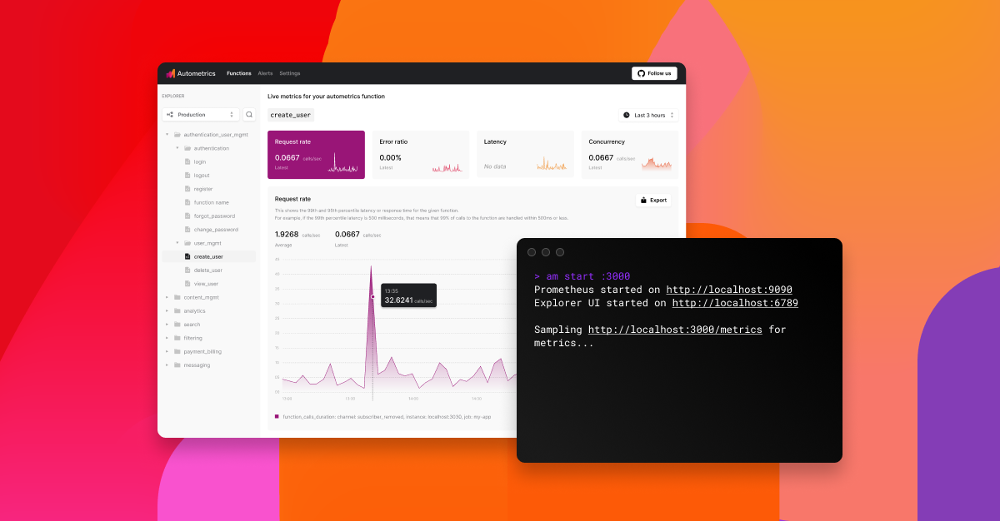

# am

`am` is the autometrics companion command line interface (CLI). It makes it easier to create a
local Prometheus environment and inspect the metrics using the explorer.

[](https://discord.gg/kHtwcH8As9)



## Features

- Download, configure and start various Prometheus components such as,
    - Prometheus - this will scrape, store and expose the metrics data
    - Pushgateway - allow for pushing metrics from batch jobs or short-lived
      processes
    - Grafana (coming soon!)
- Visualize your metrics using the explorer
- Inspect your Service Level Objectives (coming soon!)

## Getting started

### Installation

The recommended installation for macOS is via [Homebrew](https://brew.sh/):

```
brew install autometrics-dev/tap/am
```

Alternatively, you can download the latest version from the [releases page](https://github.com/autometrics-dev/am/releases)

### Quickstart


The following will download, configure and start Prometheus. Assuming you've created an application that is running locally on port `3000` it will start scraping the metrics for that service on that port:

```
am start :3000
```

You can also specify a host, scheme or a path:

```
am start https://example.com:3000/api/metrics
```

It is also possible to specify multiple endpoints:

```
am start :3000 :3030
```

Now you can visualize and inspect your metrics using the explorer by visiting `http://localhost:6789/`.


## Documentation

Visit the autometrics docs site for more details on how to use `am` and more
details about autometrics: https://docs.autometrics.dev/

## Configuration

`am` support defining a few configuration details in a `am.toml` file. These
will be used by `am start`. Committing the `am.toml` file into git allows your
entire team to have the settings as they are for your application. Example:

```toml
pushgateway-enabled = true

[[endpoint]]
job-name = "main_app"
url = "http://localhost:3030"
```

See [https://docs.autometrics.dev/local-development#configration](https://docs.autometrics.dev/local-development) for more details.

## Contributing

Issues, feature suggestions, and pull requests are very welcome!

If you are interested in getting involved:
- Join the conversation on [Discord](https://discord.gg/9eqGEs56UB)
- Ask questions and share ideas in the [Github Discussions](https://github.com/orgs/autometrics-dev/discussions)
- Take a look at the overall [Autometrics Project Roadmap](https://github.com/orgs/autometrics-dev/projects/1)

Planning to release a new version of `am`? Take a look at our [releasing](RELEASING.md) guide.

## License

`am` is distributed under the terms of both the MIT license and the Apache. See
[LICENSE-APACHE](LICENSE-APACHE) and [LICENSE-MIT](LICENSE-MIT) for details.
